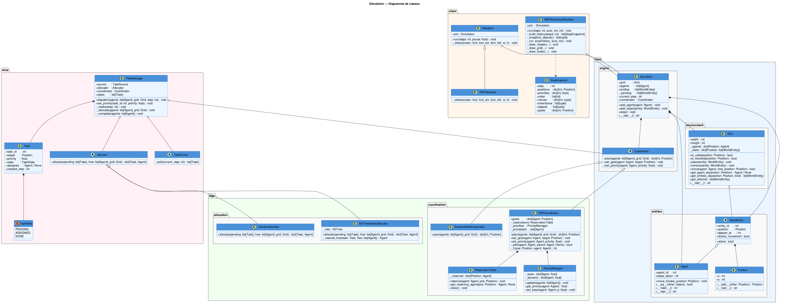

# dotbot-pibt

PIBT (Priority Inheritance with Backtracking) demos for a [DotBot][pydotbot-doc] swarm —
collision-free multi-robot navigation on a discrete grid.

📖 **Documentation:** a three-level reproduction guide (algorithm → simulator → real
hardware) lives under [`docs/`](docs/index.md) and builds as a MkDocs site (`mkdocs serve`).

## Contents

| Path | Description |
|------|-------------|
| `sim_dotbot_pibt.py` | Simulator — sends all waypoints at once. Each bot follows its path at its own pace. |
| `real_dotbot_pibt.py` | Real hardware — one waypoint at a time, with a sync barrier between each step. Keeps PIBT's collision guarantee on async hardware. |
| `draft_real_dotbot_pibt.py` | Draft real-hardware variant (250 mm cells, under evaluation). |
| `sim_pibt.py` | L0 benchmark — headless PIBT sweep over grid resolution × N × seeds. |
| `simulation/` | Standalone PIBT simulation engine (`core/`, `algo/pibt.py`). |
| `real_dotbot_pibt_batch.py` | Parametrised batch test (`--bots N --runs M`) writing L1 metrics. |
| `log/` | Experiment outputs — `raw_logs/` and metrics CSVs. |
| `docs/` | Documentation — roadmap, experiment reports, Inria hand-offs. |

### Simulation architecture



## Installation

```bash
pip install -r requirements.txt
```

## Quick start

### 1. Start the DotBot simulator

```bash
dotbot run simulator \
    --map-size 4000x4000 \
    --init-state simulator_init_state.toml
```

> `simulator_init_state.toml` defines the initial bot positions.
> See the [pydotbot documentation][pydotbot-doc] for an example.

### 2. Simulator demo (bulk waypoints)

```bash
python sim_dotbot_pibt.py
python sim_dotbot_pibt.py --dry-run       # print without sending
python sim_dotbot_pibt.py --steps 40      # 40 PIBT steps
python sim_dotbot_pibt.py --seed 42       # reproducible goals
```

### 3. Real-hardware demo (step-by-step)

```bash
python real_dotbot_pibt.py
python real_dotbot_pibt.py --dry-run
python real_dotbot_pibt.py --threshold 120 --step-timeout 10
python real_dotbot_pibt.py --min-bots 3
```

## Options

Common to both scripts:

| Option | Default | Description |
|--------|---------|-------------|
| `--base URL` | `http://localhost:8000` | pydotbot controller URL |
| `--cell-mm N` | `500` | Cell size in mm |
| `--map-cells N` | `8` | Fallback N×N grid (normally derived from the API) |
| `--steps N` | `30` | Maximum PIBT steps |
| `--threshold N` | `50` / `100` | Arrival radius per waypoint (mm) |
| `--seed N` | random | RNG seed for reproducible goals |
| `--dry-run` | — | Print without sending commands |

Extra options for `real_dotbot_pibt.py`:

| Option | Default | Description |
|--------|---------|-------------|
| `--step-timeout S` | `8.0` | Max wait per step (seconds) |
| `--settle S` | `0.3` | Pause after arrival to let bots stop |
| `--min-bots N` | `2` | Minimum localised bots required at startup |

## Grid ↔ mm mapping

```
cell (gx, gy)  →  centre mm = (gx×cell_mm + cell_mm//2, gy×cell_mm + cell_mm//2)
pos (x, y) mm  →  cell      = (int(x/cell_mm), int(y/cell_mm))
```

With `cell_mm=500` and a `4000×4000 mm` map: 8×8 grid.

## sim vs real

```
sim_dotbot_pibt.py          real_dotbot_pibt.py
─────────────────────────   ──────────────────────────────────
Computes all at once        Computes step by step
Sends N waypoints/bot       Sends 1 waypoint/bot/step
No waiting                  Sync barrier between each step
Simulator only              Simulator AND real hardware
threshold = 50 mm           threshold = 100 mm
```

## License

[BSD 3-Clause](LICENSE)

[pydotbot-doc]: https://pydotbot.readthedocs.io/en/latest/
