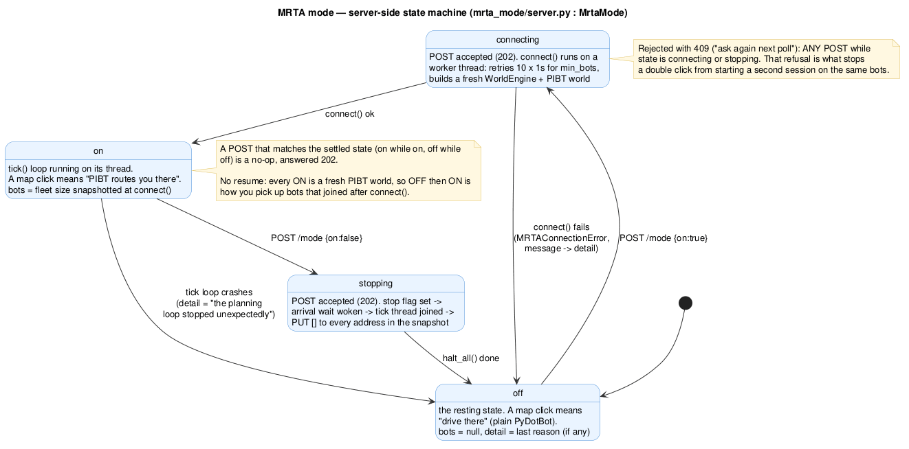

# The console toggle

The **MRTA** pill in the DotBot web console's top bar turns this repo's MRTA mode on and off
for the whole testbed. State lives in the `mrta_server.py` process, never in the browser: two
consoles open on one swarm always agree, and closing one changes nothing.

<video controls muted playsinline preload="metadata"
       poster="../assets/media/console-ui-improvements.jpg"
       style="width:100%;max-width:960px;border-radius:8px;display:block;margin:1rem 0">
  <source src="../assets/media/console-ui-improvements.mp4" type="video/mp4">
  Your browser can't play this clip —
  <a href="../assets/media/console-ui-improvements.mp4">download it</a>.
</video>

*The reworked console UI the MRTA pill lives in (2× speed).*

## The four states

The console polls `GET /mrta/status` every 1.5 s and renders `state`:

| State | Pill | What it means |
|---|---|---|
| `off` | **OFF** | server reachable, MRTA idle — a map click drives straight there |
| `connecting` | **…** amber | `POST /mrta/mode {on:true}` accepted; `connect()` is snapshotting the fleet |
| `on` | **ON** | the tick loop is running — a map click means "PIBT routes you there" |
| `stopping` | **…** amber | `POST /mrta/mode {on:false}` accepted; bots are being halted |

A fifth label, **MRTA N/A**, is *inferred by the console* from a 404, a 502, or an
unreachable host — the server never sends it. It is the resting state when nothing is behind
the proxy, and the console stays fully usable.

## The state machine

[](assets/mrta_mode_button_state_machine.png)

*Source: `diagrammes/mrta_mode_button_state_machine.puml`. Click to enlarge.*

- `off → connecting` on `POST {on:true}`; `connecting → on` when `connect()` succeeds, or
  back to `off` with the failure message in `detail` if it doesn't.
- `on → stopping → off` on `POST {on:false}`.
- **Any** `POST` while `connecting` or `stopping` is refused with `409`. The console reads a
  refusal as "ask again next poll", which is exactly what stops a double-click from starting
  a second session on the same bots.
- A `POST` that matches the settled state is a `202` no-op.
- **No resume.** Every ON builds a fresh PIBT world from a fresh fleet snapshot, so
  **OFF then ON** is how you pick up bots that joined late.

## The contract

Two routes, same-origin under `/mrta` (the proxy strips the prefix, so `mrta_server.py` sees
`/status` and `/mode`):

```text
GET  /mrta/status            → { "state", "bots", "detail" }
POST /mrta/mode  {"on":bool} → 202, same object, returning the *transition* state
```

`bots` is the snapshotted fleet size (`null` when not running). `detail` is one short tooltip
line.

## What OFF means

**OFF stops the bots** — it does not let them coast to their last commanded cell.
`mrta_mode/server.py` runs a load-bearing order:

```text
set stop flag  →  wake the arrival wait  →  join the tick thread  →  PUT [] to every address in the snapshot
```

Clearing the waypoints *before* joining would let an in-flight parallel send re-arm the bots
for one more cell. Only the addresses in the snapshot are cleared — a bot that joined after
`connect()` was never driven by MRTA.

## What changes for an operator while ON

- **A map click means "PIBT will route you there"**, not "drive straight there". Same
  gesture, different meaning — the tooltip says so.
- **Waypoint missions** (a queued chain) work: the translator turns the chain into one
  target per cell.
- **The drive pad does not.** It sends `move_raw`, which drops the firmware back to MANUAL
  while MRTA still plans in AUTO. Flip MRTA OFF before using the pad on one of its bots. This
  is a known open issue.
