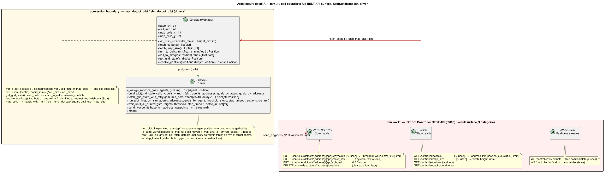
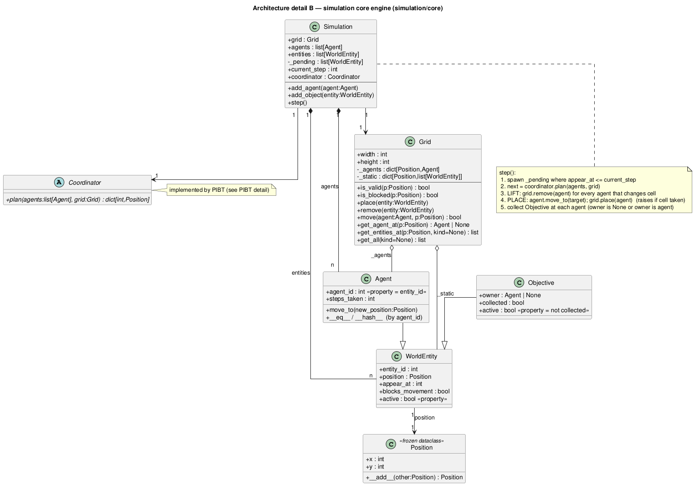
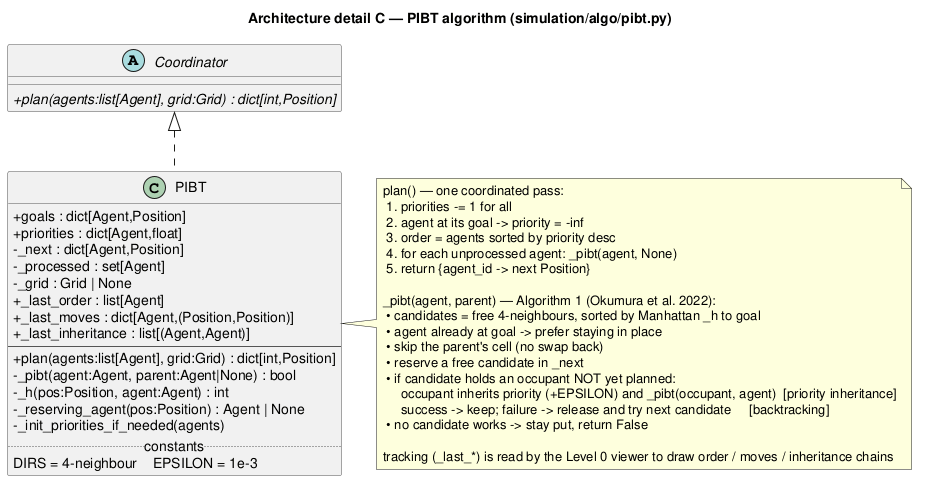

# Architecture

!!! warning "Describes a removed engine"
    `simulation/` (referenced throughout this page) was removed on 2026-08-27; reconnecting
    to the real upstream PIBT/MRTA engine is deliberate future work, not done yet — see the
    root `AGENT.md`'s "Current known inconsistencies" and `Roadmap.md` §0. This page is kept
    as a historical description of the boundary design, not a guide to running code that
    exists today.

DotBot Logistics straddles two worlds that speak different languages:

- the **mm world** — the DotBot controller's REST API, where everything is millimetres;
- the **cell world** — the (removed) `simulation/` engine, where everything is integer grid
  cells.

A thin **conversion boundary** (the `GridStateManager` and the top-level driver functions in
`real_dotbot_pibt.py` / `sim_dotbot_pibt.py`) translates between them: it reads bot positions
in mm, snaps them to cells for PIBT, then turns the planned cells back into mm waypoints.

## Overview

The high-level picture — three zones and the data that crosses between them (mm in red,
cells in green):

Of the controller's ~10 REST endpoints, the PIBT drivers use only three: two reads
(`/controller/dotbots`, `/controller/map_size`) and one command
(`PUT …/waypoints`). The detail diagrams below zoom into each zone.

## Detail A — the mm ↔ cell boundary

The full REST API surface grouped into **three categories** — state reads (`GET`), commands
(`PUT`/`DELETE`), and real-time streams (`WebSocket`) — with the endpoints the project
actually uses marked `[✓ used]`. Alongside it, `GridStateManager` (the mm↔cell converter)
and the driver module's functions.

Key points:

- **mm → cell is lossy**: `g = clamp(int(coord_mm / cell_mm), 0, map_cells-1)` — the
  sub-cell offset is discarded. Two bots that snap to the same cell are separated by
  `resolve_conflicts()` (the second moves to the nearest free neighbour).
- **cell → mm targets the cell centre**: `coord_mm = g*cell_mm + cell_mm//2`.
- `run_pibt_live` advances one PIBT step, sends one waypoint per moved bot, then blocks in
  `wait_until_all_arrived` (the synchronisation barrier) until every bot is within
  `threshold` mm of its target — or the per-step timeout fires, in which case stalled bots
  are logged and the run continues (no deadlock).

## Detail B — the simulation core engine

The `simulation/core` package: the entity hierarchy (`WorldEntity` → `Agent` / `Objective`),
the `Grid`, the pluggable `Coordinator` interface, and the `Simulation` that drives a step.

The heart is `Simulation.step()`, a *lift-then-place* pipeline: spawn any due entities,
ask the coordinator for everyone's next cell, remove all moving agents from the grid first
(so they don't block each other), place them at their targets, then collect objectives.

## Detail C — the PIBT algorithm

The `PIBT` coordinator (`simulation/algo/pibt.py`), an independent reimplementation of
Okumura et al. (2022)'s Algorithm 1.

Each `plan()` ages priorities, pins agents already at their goal to `-inf`, orders agents by
priority, and runs the recursive `_pibt()`: an agent reserves its best free neighbour by
Manhattan distance; if that cell holds a not-yet-planned occupant, the occupant **inherits**
priority and is pushed recursively, **backtracking** if no move works. The `_last_*`
tracking attributes are what the [Level 0](../level-0-algorithm.md) viewer reads to draw the
priority order, moves, and inheritance chains.

---

!!! tip "Editing the diagrams"
    Each diagram is a PlantUML source next to its PNG under `docs/assets/`
    (`arch_overview.puml`, `arch_boundary.puml`, `arch_core.puml`, `arch_pibt.puml`).
    Re-render with `plantuml -tpng docs/assets/arch_*.puml`.
