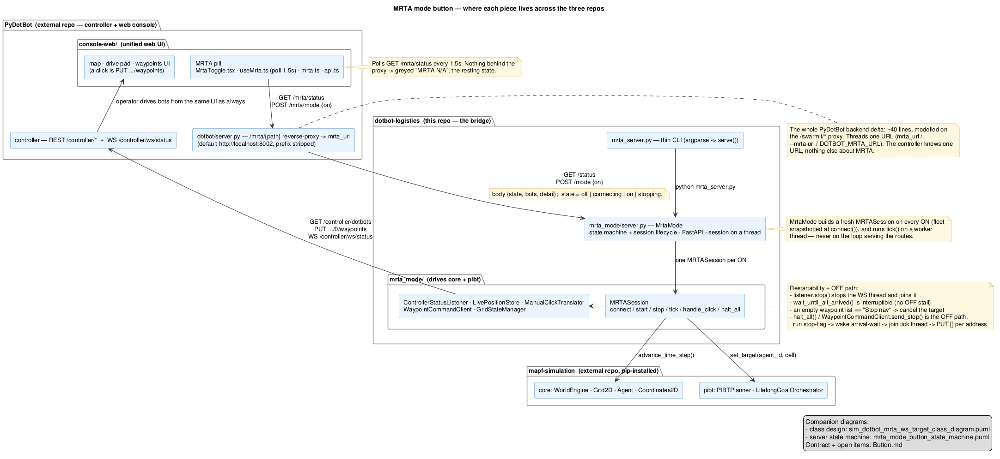
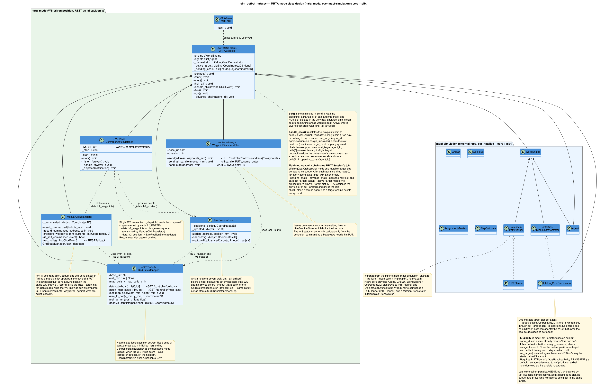

# How it works

MRTA mode turns a normal console click into a collision-free PIBT plan without changing the
DotBot UI or the controller's behaviour. This page walks the path a click takes.

## Two worlds, one boundary

The system straddles two coordinate systems:

- the **mm world** — the DotBot controller's REST/WebSocket API, where every position is in
  millimetres;
- the **cell world** — the PIBT engine, where every position is an integer grid cell.

`mrta_mode/grid_state_manager.py` is the converter. `mm → cell` is lossy
(`cell = ⌊coord_mm / cell_mm⌋`, the sub-cell offset is dropped); `cell → mm` targets the
cell centre. When two bots' measured positions snap to the same cell, `resolve_conflicts()`
nudges one to the nearest free neighbour so PIBT never starts from an impossible state.

## The pieces, across three repos

[](assets/mrta_mode_button_architecture.png)

*Source: `diagrammes/mrta_mode_button_architecture.puml`. Click to enlarge.*

- **PyDotBot** owns the console (the MRTA pill, the map, the waypoints UI) and the
  controller. Its only MRTA-specific code is a ~40-line reverse-proxy: `/mrta/{path}` →
  `mrta_url`. The controller learns one URL and nothing else about MRTA.
- **dotbot-logistics** (this repo) is `mrta_server.py` + `mrta_mode/`. `mrta_mode/server.py`
  is the state machine and HTTP surface; `mrta_mode/mrta_session.py`'s `MRTASession` owns
  the PIBT world and the collaborators that talk to the controller.
- **mapf-simulation** (pip-installed) is the planner: `core.WorldEngine` wired to
  `pibt.PIBTPlanner` and `pibt.LifelongGoalOrchestrator`.

## The click path

1. **Detection.** Every `PUT .../waypoints` the console sends — yours or MRTA's own —
   triggers a broadcast on the controller's `ws://…/controller/ws/status` channel.
   `ControllerStatusListener` is subscribed there (the same channel the frontend uses). A
   `cmd = 2` message carries *both* waypoint-set events (`data.lh2_waypoints`) and continuous
   position updates (`data.lh2_position`); the listener splits them — waypoints to a click
   queue, positions straight into `LivePositionStore`.
2. **Is it the operator?** `ManualClickTranslator` tells a real click apart from the **echo**
   of a `PUT` `mrta_server.py` itself just sent on the same channel. Genuine clicks survive;
   echoes are dropped.
3. **Translation.** The waypoint's millimetres become a grid cell (or a chain of cells for a
   multi-point mission).
4. **Planning.** `MRTASession.handle_click()` calls
   `orchestrator.set_target(agent_id, cell)` — one mutable target slot per agent, always
   overwriting. An empty chain (the console's *Stop nav*) instead cancels: `set_target` to
   the agent's own position, so the orchestrator clears the slot next tick.
5. **Stepping.** Each `tick()` advances the whole PIBT world one step
   (`WorldEngine.advance_time_step()`), then sends **one waypoint per moved bot**.

## The synchronisation barrier

After sending waypoints, `tick()` blocks in
`LivePositionStore.wait_until_all_arrived()` until every driven bot is within `--threshold`
mm of its target cell — or `--step-timeout` fires, in which case stalled bots are logged and
the run continues (no deadlock). Arrival is **event-driven**: the wait parks on per-bot
conditions set by the WebSocket position stream, and falls back to a single REST poll only if
no update arrives in time.

!!! warning "The barrier is load-bearing"
    Waiting for *every* bot to finish a step before planning the next one is what gives PIBT
    its collision-avoidance guarantee on asynchronous hardware. It is not a latency
    optimisation to cut — skipping it can put two bots in the same cell.

No pipelining, on purpose: a manual click can land mid-travel and must be reflected in the
very next `advance_time_step()`, so pre-computing a step ahead would either miss it or throw
it away.

## Multi-hop missions

`LifelongGoalOrchestrator` holds one target slot per agent — no queue. A click with several
waypoints is `MRTASession`'s job: it stores cells `[1:]` in a per-agent `_pending_chain`
`deque` and pops the next one into `set_target()` each time the agent reaches the current
one.

## The full class design

[](assets/sim_dotbot_mrta_ws_target_class_diagram.png)

*Source: `diagrammes/sim_dotbot_mrta_ws_target_class_diagram.puml`. Click to enlarge.*

`MRTASession` composes six collaborators:

| Class | File | Responsibility |
|---|---|---|
| `GridStateManager` | `grid_state_manager.py` | bootstrap bot list + map size; mm ↔ cell; the REST fallback when the WS link is down |
| `ControllerStatusListener` | `controller_status_listener.py` | the single WS client on `/controller/ws/status`; splits waypoint events from position events |
| `LivePositionStore` | `live_position_store.py` | event-driven arrival detection; the interruptible barrier |
| `ManualClickTranslator` | `manual_click_translator.py` | mm ↔ cell, dedup, self-echo detection, REST reconciliation |
| `WaypointCommandClient` | `waypoint_command_client.py` | write-path only: `PUT .../waypoints`, parallel send, `PUT []` to stop |
| `MRTASession` | `mrta_session.py` | owns the `WorldEngine` + orchestrator; `connect` / `start` / `tick` / `handle_click` / `stop` / `halt_all` |

## Grid ↔ mm mapping

```text
cell (gx, gy)   →  centre in mm = (gx·cell_mm + cell_mm//2,  gy·cell_mm + cell_mm//2)
pos (x, y) mm   →  cell         = (⌊x / cell_mm⌋,  ⌊y / cell_mm⌋)
```

Default `--map-cells 5` on a 2000×2000 mm map → `cell_mm = 400`, a 5×5 grid.
`--map-cells 8` → `cell_mm = 250`, an 8×8 grid (seed the simulator with a matching layout).
