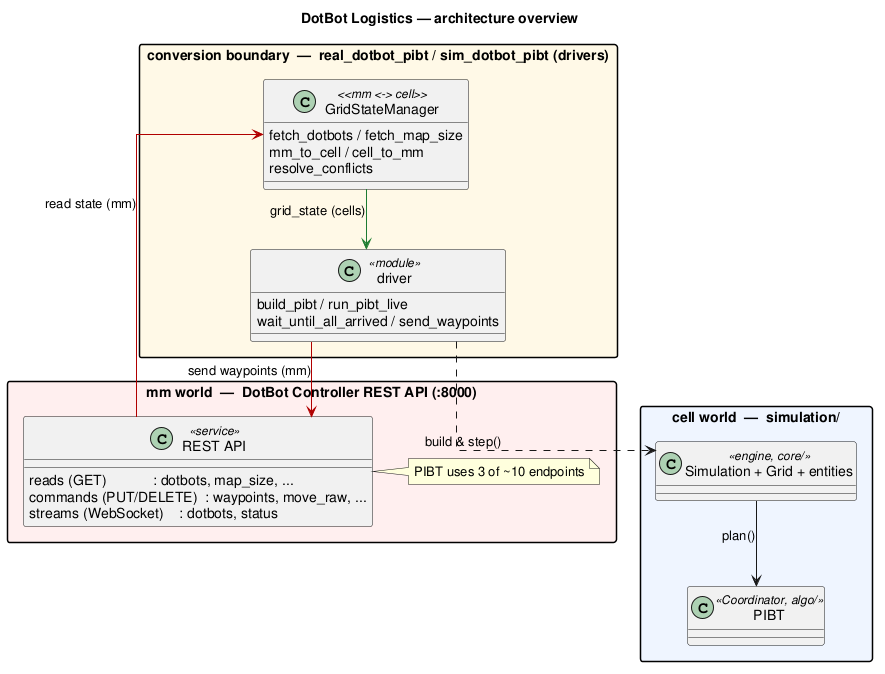

# DotBot Logistics

**Collision-free multi-robot navigation for a [DotBot](https://pydotbot.readthedocs.io/en/0.29.1/)
swarm**, built on **PIBT** (Priority Inheritance with Backtracking). Each robot is routed
on a discrete grid; PIBT guarantees that no two robots ever claim the same cell, which makes
it a natural fit for **intralogistics** — many small autonomous units moving stock around a
shared warehouse floor without colliding.

*Architecture overview — the boundary between the **mm world** (the DotBot controller's
REST API, everything in millimetres) and the **cell world** (`simulation/`, everything in
integer grid cells), bridged by `GridStateManager`. See
[Contributing → Architecture](contributing/architecture.md) for the detailed diagrams.*

## What this documentation is for

This site is a **reproduction guide**. It picks up exactly where the
[PyDotBot installation guide](https://pydotbot.readthedocs.io/en/0.29.1/) leaves off and
walks you, step by step, through everything that was built here — so you can run it yourself.

The work is organised as **three abstraction levels of increasing realism**. Each level adds
one layer between the abstract plan and the physical world, so that if something breaks you
know *which* layer to blame.

!!! tip "Where do you want to start?"

    - **Level 0 — [Run a PIBT to see how it works](level-0-algorithm.md).** The pure
      planner on an abstract grid: an interactive viewer and a headless benchmark. No robot,
      no controller — just the algorithm.
    - **Level 1 — [Plug it to fake bots](level-1-simulator.md).** Drive simulated DotBots
      through the full PyDotBot controller and web UI. Same REST API as the real swarm, so
      the code you run here runs unchanged on hardware.
    - **Level 2 — [Vrrrm! Now it's real test time](level-2-real.md).** The same plan on
      real DotBots: MQTT broker, Mari gateway, LH2 localisation, and the batch test harness
      used for the experiments.

Start with [Installation](installation.md), then follow the levels in order.

## The three levels at a glance

| Level | Reality | Entry point | What it answers |
|-------|---------|-------------|-----------------|
| **0** | Abstract grid, no robot | `simulation/demo.py`, `bench_pibt.py` | Is the planner correct, and where does it break? |
| **1** | Simulated bots + controller | `dotbot run simulator` + `sim_dotbot_pibt.py` | Does the plan drive bots through the real API? |
| **2** | Real DotBots | `dotbot run controller` + `real_dotbot_pibt.py` | Does it survive real physics? |
