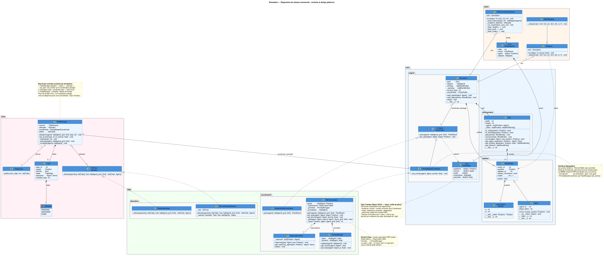

# Project guide — MAPF Simulation

A friendly tour of the project: what it is, how to run it, how the pieces fit, and
where to look when you want to change something. For the exhaustive class-by-class
reference, see [`AGENT.md`](AGENT.md); for git conventions, see
[`CONVENTION.md`](CONVENTION.md).

---

## What is this?

A small **Multi-Agent Path Finding (MAPF)** simulator. Several agents live on a grid,
each wants to reach a goal cell, and a **coordinator** decides — every step — where
everyone moves so that no two agents collide. The headline coordinator is **PIBT**
(Priority Inheritance with Backtracking): low-priority agents step aside for
higher-priority ones, and the algorithm backtracks when a chosen move turns out to be
a dead end.

On top of the movement layer sits an optional **task-allocation** layer (`mrta/`):
tasks appear over time, get matched to free agents, and their targets are pushed to the
coordinator as goals.

---

## Quickstart

```bash
# (optional) virtual environment
python -m venv .venv && source .venv/bin/activate

pip install -r requirements.txt
```

Then run one of the demos from the repository root:

```bash
python demo_pibt.py       # interactive PIBT demo (5×5 grid)
python demo_pibt.py -d    # same, but prints each step to the terminal (no window)
python main.py            # random-walk demo (10×10 grid)
```

In the interactive window: `Space` play/pause · `→` step forward · `←` step back ·
`Q`/`Esc` quit. The footer shows, for each step, the priority order, every agent's
move, and any priority inheritances that were triggered.

---

## How it fits together

Four packages, with a strict one-way dependency flow:

```
client ─┐
        ├─► core ◄─── mrta ◄─── algo
        └───────────────────────┘
```

- **`core/`** — the pure engine, no rendering, no algorithm. Holds the world:
  `Position`, `WorldEntity`, `Agent`, `Grid`, the `Simulation` loop, and the
  `Coordinator` interface plus its `PlanResult` return type.
- **`algo/`** — the algorithms. `coordination/` has PIBT and a random walk;
  `allocation/` has the task allocators. Pure logic, never imports rendering.
- **`mrta/`** — task allocation: `Task`, `TaskSource`, `Allocator`, and `FleetManager`,
  which hands goals to the coordinator. Depends only on `core`.
- **`client/`** — the pygame viewers. Read-only over the simulation; they display
  what `core` produces and never reach into `algo`.

The key handshake: `Simulation.step()` asks the coordinator to `plan()` and gets back a
`PlanResult` (next positions + diagnostics). `FleetManager` and the coordinator share
the *same* object, so allocation and movement stay in sync.

For the visual overview, see the class diagram:



---

## Where to look for X

| I want to…                                   | Go to…                                          |
|:---------------------------------------------|:------------------------------------------------|
| Change how agents move / the MAPF algorithm  | `algo/coordination/`                            |
| Add a new coordinator                        | `algo/coordination/` (subclass `Coordinator`)   |
| Change how tasks are matched to agents       | `algo/allocation/`                              |
| Change the task lifecycle / dispatch loop    | `mrta/fleet_manager.py`                         |
| Change the grid, entities, or the step loop  | `core/`                                          |
| Change what the window draws                 | `client/`                                       |
| Change a demo scenario                       | `demo_pibt.py`, `main.py`                       |
| Update the class diagram                     | `diagrammes/diag_commente.puml` (+ `plantuml`)  |

---

## Extending it

**A new coordinator** — subclass `Coordinator`, implement `plan()`, return a
`PlanResult`:

```python
from core import Coordinator, PlanResult

class MyAlgo(Coordinator):
    def plan(self, agents, grid) -> PlanResult:
        positions = {a.agent_id: a.position for a in agents}   # your logic here
        moves = {a.agent_id: (a.position, positions[a.agent_id]) for a in agents}
        return PlanResult(positions=positions, moves=moves)
```

Plug it in with `Simulation(grid, coordinator=MyAlgo())`.
`algo/coordination/random_walk.py` is the smallest working example.

**A new allocator** — subclass `Allocator` and implement
`allocate(pending, free, grid)`. `algo/allocation/random_allocator.py` shows the shape;
`KDTreeGreedyAllocator` is a deliberate stub left for a future design discussion.

---

## Documentation map

| File            | Audience   | Purpose                                            |
|:----------------|:-----------|:---------------------------------------------------|
| `README.md`     | everyone   | short overview, install, run                       |
| `GUIDE.md`      | humans     | this guided tour                                   |
| `AGENT.md`      | agents/devs| exhaustive per-class architecture reference        |
| `CONVENTION.md` | contributors | git, branch, commit and issue conventions        |
